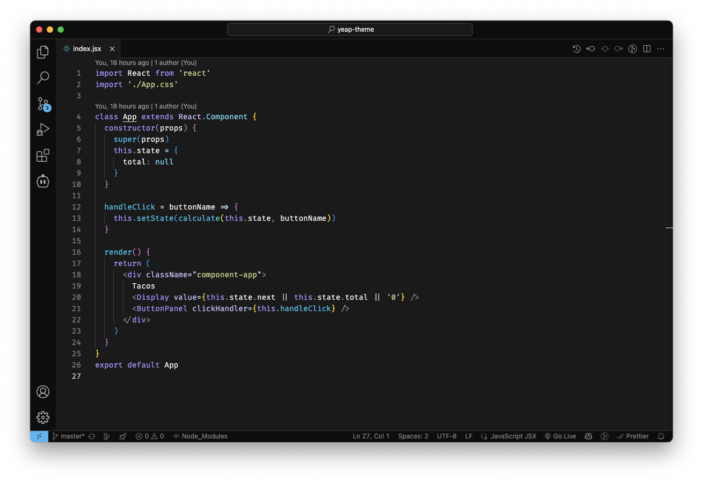

<div align="center">
  <h1 align="center">Yeap Theme</h1>
  <p align="center">An official Yeap theme for Visual Studio Code.</p>
</div>
<p align="center">
  
</p>

## Install

Install this syntax theme [from the Marketplace][theme-install].

## Recommendations

Below you can find a few recommendations for your `settings.json` to match the Yeap experience even closer in your Visual Studio Code:

```json
{
  // Editor
  "editor.smoothScrolling": true,
  "editor.fontSize": 14,
  "editor.fontFamily": "'Fira Code'",
  "editor.mouseWheelZoom": false,
  "editor.fontLigatures": true,
	"editor.minimap.size": "proportional",
  "editor.cursorBlinking": "expand",
  "editor.cursorSmoothCaretAnimation": "on",
  "window.titleBarStyle": "custom",
  // Terminal
  "terminal.integrated.mouseWheelZoom": false,
  "terminal.integrated.cursorStyle": "line",
  "terminal.integrated.cursorBlinking": true,
  // As you like
  "breadcrumbs.enabled": false,
  "editor.minimap.enabled": false,
}
```

> You can download the [Fira Code font][fira-code-install] from GitHub.

[fira-code-install]: https://github.com/tonsky/FiraCode